<div align="center">

#  Hi, I'm **Ashwin V**

### 💻 Software Developer in Progress

**Building • Learning • Solving • Improving**

<br/>

<a href="https://ashwinv1202portfolio.netlify.app">

</a>

<a href="https://linkedin.com/in/ashwin-v-b386012b0">

</a>

<a href="mailto:ashwinv2023@gmail.com">

</a>

<br/><br/>


<br/>

### 🚀 Turning ideas into code, one project at a time.

</div>

---

## 🧑‍💻 About Me

```javascript
const ashwin = {
    role: "Aspiring Software Developer",
    education: "Engineering Student",

    languages: [
        "Java",
        "Python",
        "JavaScript",
        "C"
    ],

    interests: [
        "Full Stack Development",
        "Web Development",
        "AI Applications",
        "Problem Solving"
    ],

    currentlyLearning: [
        "React",
        "Backend Development",
        "Full Stack Development"
    ],

    goal: "Build useful software and grow as a developer",

    openTo: "Internship Opportunities 🚀"
};
```

---

## ⚡ Currently Working On

* 🚀 Building full-stack web applications
* ⚛️ Improving React & JavaScript
* 🧠 Practicing DSA and problem solving
* 🤖 Exploring AI-powered applications
* 🔧 Learning backend development
* 💼 Preparing for software development opportunities

---

## 🛠️ Tech Stack

### 💻 Programming Languages

<p>

</p>

### 🌐 Frontend Development

<p>

</p>

### ⚙️ Backend & Database

<p>

</p>

### 🔧 Tools

<p>

</p>

---

## 🚀 Featured Projects

### 🎵 Musify

**Music Streaming Web Application**

A modern music platform with authentication, albums, playlists, favorites and a custom audio player.

**Built with:** React • Vite • Tailwind CSS • Firebase • Cloudinary

---

### 🎬 MovieVerse 

**Movie Recommendation System**

A full-stack movie discovery and recommendation platform inspired by modern streaming services. Integrated the TMDB API to provide real-time movie data, including trending content, detailed movie information, and cast details.

Key Features

🎥 Real-time movie and trending content discovery
🔎 Movie details and cast information
🎯 Recommendation-focused browsing experience
⚡ Dynamic data powered by the TMDB API
📱 Responsive streaming-platform-inspired interface

**Built with:** React • Flask • Tailwind • CSS • TMDB API

---

### 🧠 Real-Time Deepfake Detection System

A multi-modal forensic framework designed for real-time deepfake detection using physiological and frequency-domain signals. The system combines automated face detection, rPPG-based analysis, frequency-domain features, and machine learning classification to identify manipulated video content.

Key Features

🎥 Real-time video analysis
👤 Automated face detection pipeline
❤️ rPPG-based physiological signal analysis
📡 Frequency-domain feature extraction
🤖 Random Forest-based classification
📊 60–75% detection accuracy on a benchmark dataset of 100+ videos

**Built with:** Python • OpenCV • Streamlit • Scikit-learn

---

## 📊 GitHub Analytics

<div align="center">
    


</div>

---

## 🐍 Contribution Activity

<div align="center">

<picture>
  <source
    media="(prefers-color-scheme: dark)"
    srcset="https://raw.githubusercontent.com/Ashwin-1202/Ashwin-1202/output/github-contribution-grid-snake-dark.svg"
  />

  <source
    media="(prefers-color-scheme: light)"
    srcset="https://raw.githubusercontent.com/Ashwin-1202/Ashwin-1202/output/github-contribution-grid-snake.svg"
  />

  

</picture>

</div>
---

## 🌐 Connect With Me

<div align="center">

<a href="https://ashwinv1202portfolio.netlify.app">

</a>

<a href="https://linkedin.com/in/ashwin-v-b386012b0">

</a>

<a href="mailto:ashwinv2023@gmail.com">

</a>

</div>

---

<div align="center">

### 💭 *"Always learning. Always building. Always improving."*

<br/>

⭐ **Thanks for visiting my profile!**

</div>
